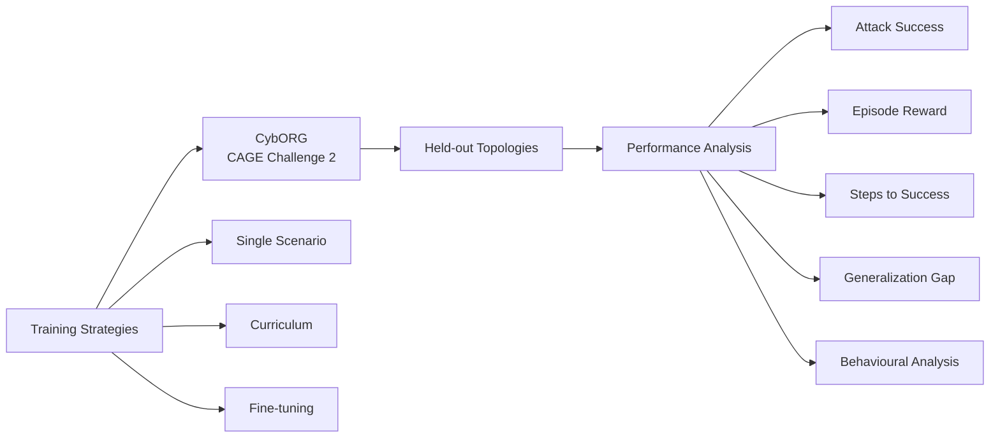

# CybORG RL Red-Team Agent

### Final year research project on reinforcement learning for autonomous penetration testing.

An experimental study of how training strategy affects the ability of RL red-team agents to generalise from one network to unseen network topologies in CybORG.

[**Repository**](https://github.com/T0T0R0-byte/cyborg-rl-redteam)

---

## Research Question

**Can an RL red-team agent trained on one network successfully attack a network it has never seen?**

The project investigates this through a controlled comparison of three training strategies in the CybORG environment.

The repository reflects the current research stage. Training results are not claimed before the experiments are completed.

## Why This Matters

Autonomous penetration testing has shown promise, but performance often changes when agents encounter environments outside their training distribution.

The project focuses on the practical question behind that problem:

> Which training strategy gives an RL red-team agent the strongest and most reliable generalisation to unseen network topologies?

## Experimental Design

All strategies use the same environment and evaluation protocol so performance differences are attributable to the training strategy rather than a different test setup.

## Agents and Baselines

### Agents

PPO-based red-team agents trained with:

- Single-scenario training
- Multi-topology curriculum training
- Fine-tuning on a target topology

### Baselines

- Scripted B-line attacker
- Random policy
- In-distribution performance

These baselines provide reference points for measuring whether learned policies offer a meaningful improvement.

## Evaluation

The evaluation is designed around held-out scenarios rather than testing only on networks seen during training.

Key measures include:

| Metric | Purpose |
| --- | --- |
| **Attack success rate** | Measures whether the agent completes the attack objective |
| **Episode reward** | Measures overall task performance |
| **Steps to success** | Measures how efficiently successful attacks are completed |
| **Generalisation gap** | Compares performance on training and unseen topologies |
| **Action distributions** | Helps identify reward gaming and suspicious policy behaviour |

Repeated seeds and statistical analysis are used instead of relying on a single training run.

## Research Questions

| RQ | Question |
| --- | --- |
| **RQ1** | How does training strategy affect generalisation to unseen topologies? |
| **RQ2** | How much high-scoring performance transfers to unseen networks, and which failure modes dominate? |
| **RQ3** | Do high-scoring agents learn useful attack strategies or exploit the reward function? |
| **RQ4** | Do simulation-trained agents transfer to a higher-fidelity CybORG variant? |

## Planned Deliverables

1. PPO agents trained under all three strategies
2. A held-out evaluation and benchmarking harness
3. Documented scripted and random baselines
4. A reproducible public release containing the experimental setup and results

## Scope

### In Scope

- Single-agent red-team behaviour
- Fixed blue-team configuration
- CybORG and topology variants
- PPO agents
- Quantitative experimental evaluation
- Repeated-seed comparison

### Out of Scope

- Multi-agent RL
- Real-world deployment
- LLM-based agents
- Attacks against real systems

## Project Resources

The design targets a practical, low-cost setup using Python, PyTorch and RL tooling. Development is planned around a 16 GB RAM machine with CPU experimentation and free Colab GPU resources where useful.

No human participants or real production systems are involved.

## Project Documents

| Document | Purpose |
| --- | --- |
| [Research Design](docs/research-design.md) | Full research positioning, questions, method and evaluation plan |
| [Initial Proposal](docs/initial-proposal.md) | Proposal submitted for project approval |
| [Literature Review](docs/literature-review.md) | Review of RL-based autonomous penetration testing and generalisation |
| [One-page Summary](docs/one-page-summary.md) | Compact overview of the project |

## Current Status

**Research design and literature review stage.**

The next stage is implementation of the CybORG training and benchmarking pipeline, followed by controlled experiments and statistical evaluation.

No experimental result is presented as a finding until it has been measured.

## Author

**Faraj Farook** · CB012653  
BSc (Hons) Cyber Security

## License

MIT. See [LICENSE](LICENSE).

Built as a final year cybersecurity research project.

